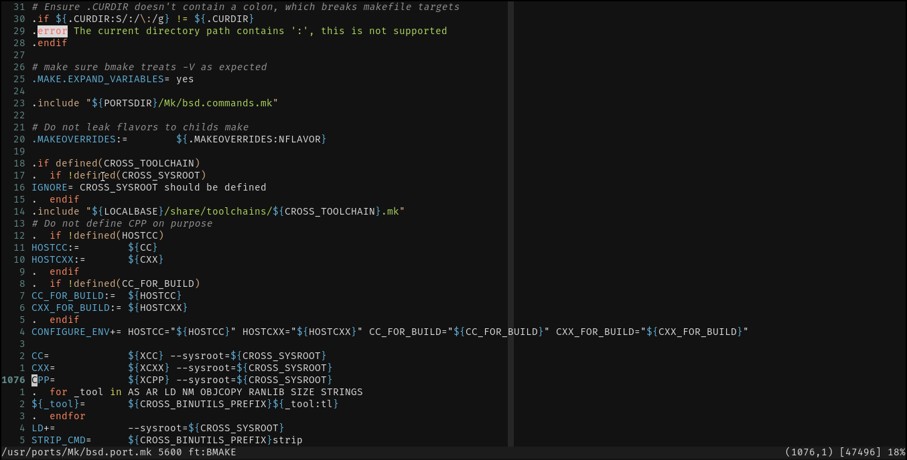
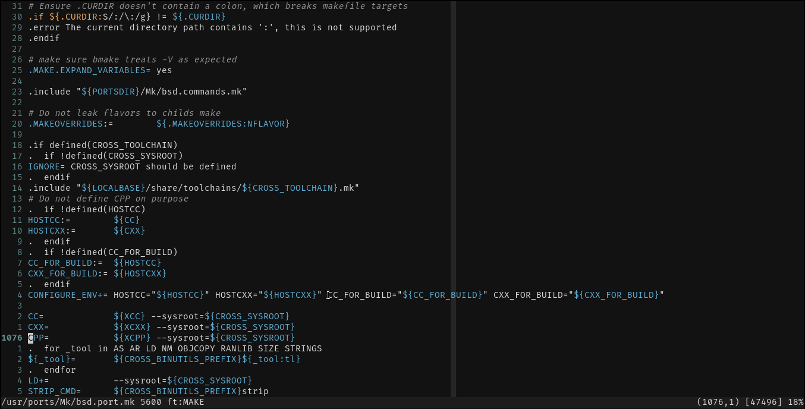

# bmake.vim: Enhanced syntax highlighting for BSD Makefiles.

Originally copied over from Vim 9.2's make.vim syntax files; this project aims
to provide support for particularities of BSD make's syntax and features for
Vim.

# Syntax highlighting comparison:
 
### bmake.vim:

### Vim's default:

---
License: Same licence as Vim if to be shipped with it, BSD 4-clause in all
other cases. 
